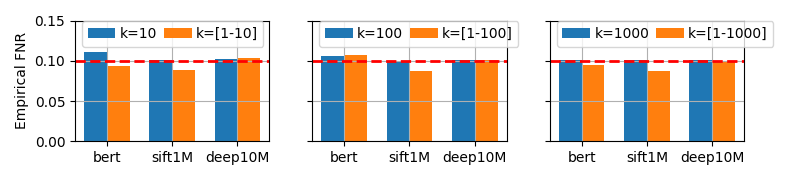
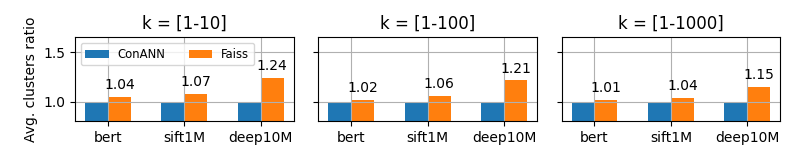

# ConANN: Conformal Approximate Nearest Neighbor Search

## Content
- `conann/`: extensions of faiss-1.9.0 with ConANN modifications to IndexIVF.
- `conann/eval`: parameterised experiment executors for ConANN
- `faiss-1.9.0/`: fork form [github/facebookresearch/faiss](https://github.com/facebookresearch/faiss) version 1.9.0
- `faiss-1.9.0/eval`: parameterised experiment executors for faiss-1.9.0
- `auncel/`: faithful port of [github/pkusys/Auncel](https://github.com/pkusys/Auncel) from faiss-1.15.2 to faiss-1.9.0
- `auncel/eval`: parameterised experiment executors for Auncel

## Prerequisites

The experiments were conducted on Google Cloud Platform (GCP) using a virtual machine with an Intel(R) Xeon(R) CPU @ 2.80GHz, 64 vCPUs, 256 GB RAM, and Ubuntu 20.04.6 LTS. To achieve comparable performance the Intel-MKL SIMD instruction set needs to be installed on the machine.

## Datasets

The data sources can be found here:
- SIFT (1M): http://corpus-texmex.irisa.fr 
- GIST (1M): http://corpus-texmex.irisa.fr
- Fasttext (1M): https://huggingface.co/fse/fasttext-wiki-news-subwords-300
- DEEP (10M): https://disk.pku.edu.cn/link/AAD0A67DE2E7984DB5B5D4885871219AEF
- Bert (30522): The Bert embeddings have been extracted from the pre-trained model available on HuggingFace using the following code snippet:
```
from transformers import BertModel

def get_bert_emb():
    model_name = "bert-base-uncased"
    model = BertModel.from_pretrained(model_name)
    word_embeddings = model.embeddings.word_embeddings.weight
    word_embeddings_np = word_embeddings.detach().cpu().numpy()
    print("Word Embedding Shape:", word_embeddings.shape)
    return word_embeddings_np
```
---

The datasets should be placed in a folder named `data/<dataset_name>`. File format should be `.fvecs`, a simple binary format for storing float vectors.
Apart from the training set the following files are required:
- `queries.fvecs`
- `distances-10.fvecs`
- `distances-100.fvecs`
- `distances-1000.fvecs`
- `indices-10.fvecs`
- `indices-100.fvecs`
- `indices-1000.fvecs`
> Check `conann/conann/eval/error.cpp` for exact naming if data loading problems occur.

To create the query sample and ground truths using `experiments/experiment_controller.py` is recommended, as it contrains convenience methods for this purpose. The following programs need to be compiled first:
```
cd Auncel
cmake -DCMAKE_BUILD_TYPE=Release -DFAISS_ENABLE_GPU=OFF -DFAISS_ENABLE_PYTHON=OFF -B build .
make -C build -j sample_queries
make -C build -j compute_gt
```

## Build

Compile all the executors:

Auncel:

```
cd Auncel
cmake -DCMAKE_BUILD_TYPE=Release -DFAISS_ENABLE_GPU=OFF -DFAISS_ENABLE_PYTHON=OFF -DBUILD_TESTING=OFF -B build .
make -C build -j sample_queries
make -C build -j compute_gt
make -C build -j effect_error
```

Faiss:

```
cd faiss-1.9.0
cmake -DCMAKE_BUILD_TYPE=Release -DFAISS_ENABLE_GPU=OFF -DFAISS_ENABLE_PYTHON=OFF -DBUILD_TESTING=OFF -B build .
make -C build -j error
```

ConANN:

```
cd conann
cmake -DCMAKE_BUILD_TYPE=Release -DFAISS_ENABLE_GPU=OFF -DFAISS_ENABLE_PYTHON=OFF -DBUILD_TESTING=OFF -B build .
make -C build -j error
make -C build -j latency
```

## Experiments

All experiment setups are documented in and can be executed using the `experiment-controller.py` script.

```
cd experiments
python3 experiment-controller.py
```

### Experiments with variable k

If ConANN is calibrated using a fixed k but then applied to queries with varying k (i.e., queries with k values unseen during calibration), the formal validity guarantees may no longer hold, as the calibration dataset distribution would differ from the test one. However, neither the ConANN design nor the CRC framework itself imposes calibration on a single static k. We explore calibrating and testing over a range of k values that cover expected query scenarios. We concluded that ConANN’s advantages hold in this scenario as well: ConANN is able to effectively control the FNR while matching or even decreasing the search space needed. The experiments are detailed below. 

#### Results

We conducted new experiments on three datasets, BERT, SIFT1M, and DEEP10M, and devised two calibration scenarios: one where a static k value is employed for both calibration and test (similar to the setup presented in the paper), and one with variable k, where ConANN is calibrated on a query dataset where each query gets assigned a value for k chosen uniformly at random in a given range. For example, for k=[1, 10], each query in the calibration dataset gets assigned a random integer value of k between 1 and 10, which will be used in the calibration process. 

First, we test the validity guarantee and plot the results in Figure A. We measure minor deviations from the target FNR, maximum of 0.012 FNR for all three datasets, highlighting ConANN’s robustness under variable k.

<!--  -->

<div style="text-align: center;">
<figure>
  
  <figcaption>Figure A: Validity results under variable k conditions. ConANN offers effective FNR control over the tested datasets, even if k varies.</figcaption>
</figure>
</div>


Next, to confirm that validity is not achieved by overly conservative predictions (i.e., extending the search space excessively), we also compared ConANN’s efficiency with Faiss as a sanity check under requested FNR 10%. Figure B shows that ConANN maintains or improves efficiency relative to Faiss, even under variable-k calibration. For example, on DEEP10M, Faiss searches 24% more clusters than ConANN when the range of k is between 1 and 10, a gap that narrows to 15% when the k range is extended to 1-1000. This reflects a natural tradeoff: broader k ranges require more representative calibration data, as expected in conformal methods.

<div style="text-align: center;">
<figure>
  
  <figcaption>Figure B: Efficiency results under variable k conditions (requested FNR = 10%). ConANN achieves reliable FNR control without sacrificing efficiency.</figcaption>
</figure>
</div>


Therefore, our new results show that ConANN achieves valid FNR control without sacrificing efficiency under realistic variable k conditions. We note that test-time k values outside the calibration range may still break the validity guarantee.

#### How to run

These exeriments reside on a different git branch called: `variable-k`.

ConANN (variable k):

```
git checkout variable-k
cd conann
cmake -DCMAKE_BUILD_TYPE=Release -DFAISS_ENABLE_GPU=OFF -DFAISS_ENABLE_PYTHON=OFF -DBUILD_TESTING=OFF -B build .
make -C build -j variable_k
```

Faiss (variable k):

```
git checkout variable-k
cd faiss-1.9.0
cmake -DCMAKE_BUILD_TYPE=Release -DFAISS_ENABLE_GPU=OFF -DFAISS_ENABLE_PYTHON=OFF -DBUILD_TESTING=OFF -B build .
make -C build -j variable_k
```